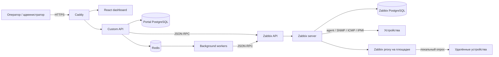

# Архитектура

## Цели

Платформа должна:

1. собирать доступность, производительность и аппаратные показатели сетевых
   устройств, серверов, рабочих станций и ИБП;
2. предоставлять единый кастомный dashboard для операторов;
3. сокращать добавление типового устройства до мастера из 3–5 шагов;
4. централизованно управлять шаблонами, группами, площадками и учётными данными;
5. устанавливаться на чистый VPS одной командой и иметь воспроизводимые
   обновления и резервное копирование.

## Выбранный стек

Для этого набора объектов выбран Zabbix, а не чистый Prometheus или LibreNMS.
Prometheus хорошо подходит для cloud-native metrics, но сам по себе не закрывает
inventory, SNMP discovery, agent management и problem lifecycle. LibreNMS очень
удобен для сетевого SNMP, но серверы, рабочие станции и единый процесс добавления
разнородных объектов потребуют больше внешних компонентов. Zabbix даёт наиболее
ровную базу для всех четырёх классов: сеть, компьютеры, серверы и ИБП.

| Критерий | Zabbix | LibreNMS | Prometheus stack |
|---|---|---|---|
| SNMP/network discovery | сильная сторона | сильная сторона | нужны exporters/config tooling |
| Linux/Windows agents | встроено | ограниченно | node/windows exporters |
| ИБП/IPMI | templates, SNMP, IPMI | преимущественно SNMP | exporters |
| Events/triggers/maintenance | встроено | встроено для network use case | Alertmanager + дополнительные компоненты |
| Удалённые площадки | Zabbix proxy | distributed poller | federation/agent architecture |
| API для custom portal | полный JSON-RPC | REST API | несколько API по компонентам |

Prometheus/OpenTelemetry остаются подходящими для самомониторинга custom API и
могут быть добавлены без замены Zabbix как основного monitoring core.

| Область | Технология | Причина |
|---|---|---|
| Monitoring core | Zabbix 7.0 LTS | SNMP, agent/agent2, IPMI, JMX, ICMP, discovery, triggers, proxies |
| Custom API | Python 3.12 + FastAPI | строгий OpenAPI-контракт и удобные async-интеграции |
| Фоновые задачи | Celery + Redis | discovery, массовое добавление, синхронизация и retry |
| Метаданные портала | PostgreSQL 16 | транзакции, JSONB, аудит; отдельная БД/схема от Zabbix |
| Frontend | React + TypeScript | кастомный dashboard и пошаговый мастер настройки |
| Edge/TLS | Caddy | автоматический TLS и reverse proxy |
| Доставка | Docker Compose | воспроизводимая установка на одном VPS |
| Наблюдаемость | OpenTelemetry + Prometheus endpoint | метрики, трассировки и логи самого портала |

В MVP Redis и отдельная БД портала добавляются вместе с custom backend. Базовый
bootstrap из этого репозитория поднимает только PostgreSQL и Zabbix.

## Контекст компонентов

## Границы ответственности

### Zabbix

- hosts, host groups, templates, items, triggers и maintenance;
- history, trends, events и problem lifecycle;
- network discovery, low-level discovery и сбор телеметрии;
- доставка уведомлений после переходного периода;
- proxy для сегментов, недоступных напрямую из VPS.

### Custom backend

- аутентификация портала и RBAC;
- каталог площадок и логическое представление устройств;
- мастер добавления и проверка параметров до применения;
- безопасные профили SNMP/agent/IPMI без возврата секретов в UI;
- идемпотентная оркестрация вызовов Zabbix API;
- агрегация данных для dashboard, кэш и server-sent events;
- аудит действий и фоновые операции.

### Frontend

- обзор состояния по площадкам и типам устройств;
- список проблем с фильтрами, подтверждением и комментариями;
- карточка устройства: доступность, ключевые графики, интерфейсы, питание;
- мастер добавления устройства и управление профилями;
- административные настройки и журнал аудита.

## Каналы мониторинга

| Тип | Основной способ | Резервный способ | Базовые показатели |
|---|---|---|---|
| Router/switch/AP | SNMPv3 | ICMP, vendor API | availability, CPU/RAM, temperature, ports, errors, traffic |
| Linux server | Zabbix agent2 active | SNMP/SSH | CPU, RAM, disks, FS, processes, services, logs |
| Windows/PC | Zabbix agent2 active | WMI через agent | CPU, RAM, disks, services, events, inventory |
| Hypervisor | API template/agent | SNMP | hosts, VMs, datastores, hardware health |
| UPS | SNMPv3 | NUT/vendor API | load, runtime, battery, input/output, bypass, alarms |
| Out-of-band | IPMI/Redfish | SNMP | sensors, power, fans, RAID/hardware alarms |

SNMPv3 `authPriv` является вариантом по умолчанию. SNMPv2c допускается только
для legacy-оборудования в изолированной management-сети.

## Потоки данных

### Добавление устройства

1. API валидирует адрес, площадку, тип и профиль подключения.
2. Worker выполняет ICMP и protocol-specific probe без сохранения секрета в
   задаче или логе.
3. Rule engine определяет vendor/model и предлагает шаблоны.
4. API показывает preview: host group, interfaces, templates, macros, proxy.
5. После подтверждения создаётся operation с idempotency key.
6. Worker вызывает `host.create`/`host.update` и фиксирует Zabbix `hostid`.
7. Readiness check ожидает первые данные и возвращает диагностический результат.

### Dashboard

Backend запрашивает inventory, problems, SLA и агрегированные trend-значения
через Zabbix API, нормализует ответ и кэширует его на 15–60 секунд. UI не имеет
учётных данных Zabbix и никогда не обращается к Zabbix напрямую.

## Развёртывание

### MVP на одном VPS

- 4 vCPU, 8 GB RAM, 100 GB SSD — стартовая конфигурация до приблизительно 500
  устройств при умеренном числе items;
- все сервисы в Docker Compose;
- порт 443 доступен операторам, 10051/TCP — только агентам и proxy;
- Zabbix UI привязан к loopback или административной VPN;
- ежедневный backup БД и конфигурации во внешнее хранилище.

Размер VPS определяется не только количеством устройств, а числом enabled items,
интервалами опроса, NVPS и сроком хранения. До production необходимо провести
двухнедельный пилот и пересчитать ресурсы по фактическим данным.

### Рост

1. Zabbix proxies по площадкам и сегментам сети.
2. Отдельный узел PostgreSQL и pgBackRest.
3. Несколько stateless API и worker replicas.
4. Redis Sentinel/managed Redis.
5. HA Zabbix server только после появления измеримой потребности.

## Ключевые архитектурные правила

- запрещены прямые записи custom backend в БД Zabbix;
- секреты шифруются envelope encryption и маскируются в логах;
- все изменяющие операции имеют idempotency key и audit event;
- API пользователя отделён от service account Zabbix;
- шаблоны Zabbix хранятся в Git и импортируются версионированно;
- автоматическое discovery не создаёт production hosts без preview/политики;
- удалённые площадки подключаются через proxy, а не открытием всех устройств в
  Интернет.
